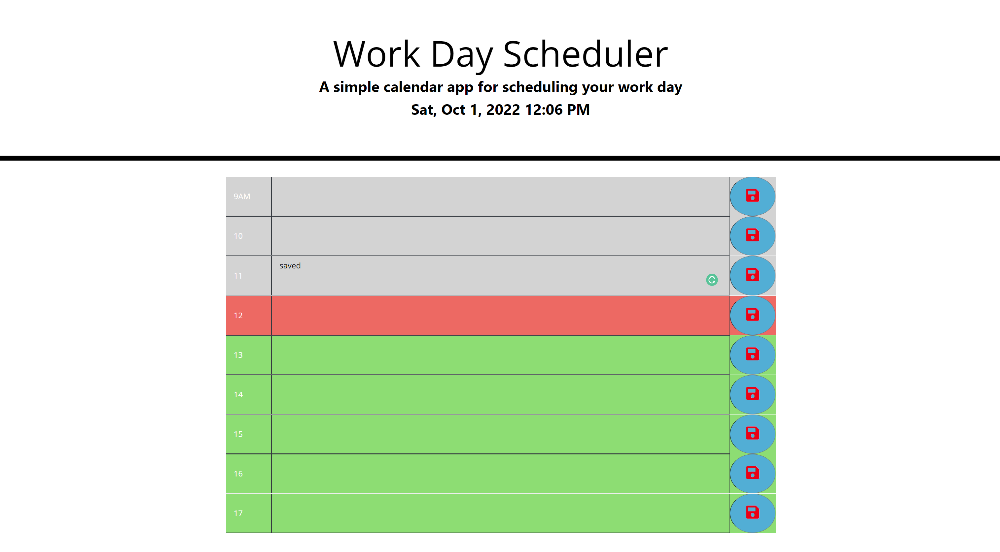

# Work Day Scheduler Starter Code

Created a simple calendar application that allows a user to save events for working hours of the day. 

Deployed Link: https://burakcersit.github.io/Work-Day-Scheduler/

Technologies used are: HTML, CSS, Javascript, JQuery, Bootstrap, Moment.js

##Screenshot

